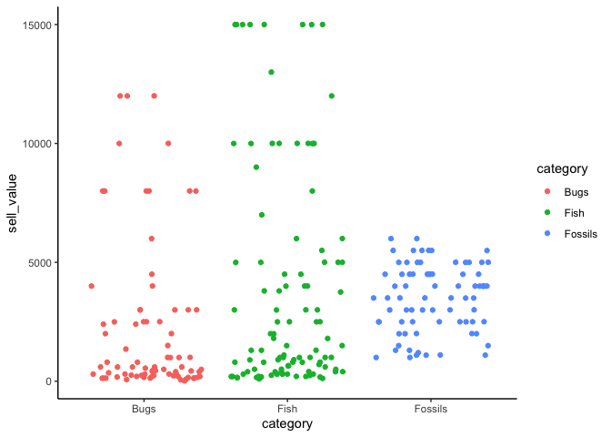
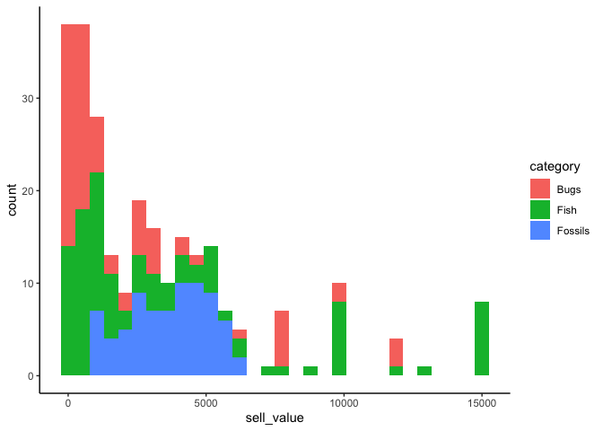

<!-- README.md is generated from README.Rmd. Please edit that file -->

# acnh

<!-- badges: start -->

<!-- badges: end -->

Tidy Tuesday featuring Animal Crossing New Horizons data:
<https://github.com/rfordatascience/tidytuesday/tree/master/data/2020/2020-05-05>

``` r
library(here)
library(tidyverse)
theme_set(theme_classic())
```

``` r
items <- readr::read_csv('https://raw.githubusercontent.com/rfordatascience/tidytuesday/master/data/2020/2020-05-05/items.csv')
#> Parsed with column specification:
#> cols(
#>   num_id = col_double(),
#>   id = col_character(),
#>   name = col_character(),
#>   category = col_character(),
#>   orderable = col_logical(),
#>   sell_value = col_double(),
#>   sell_currency = col_character(),
#>   buy_value = col_double(),
#>   buy_currency = col_character(),
#>   sources = col_character(),
#>   customizable = col_logical(),
#>   recipe = col_double(),
#>   recipe_id = col_character(),
#>   games_id = col_character(),
#>   id_full = col_character(),
#>   image_url = col_character()
#> )
#> Warning: 2 parsing failures.
#>  row          col           expected actual                                                                                                  file
#> 4472 customizable 1/0/T/F/TRUE/FALSE    Yes 'https://raw.githubusercontent.com/rfordatascience/tidytuesday/master/data/2020/2020-05-05/items.csv'
#> 4473 customizable 1/0/T/F/TRUE/FALSE    Yes 'https://raw.githubusercontent.com/rfordatascience/tidytuesday/master/data/2020/2020-05-05/items.csv'
head(items)
#> # A tibble: 6 x 16
#>   num_id id    name  category orderable sell_value sell_currency buy_value buy_currency sources
#>    <dbl> <chr> <chr> <chr>    <lgl>          <dbl> <chr>             <dbl> <chr>        <chr>  
#> 1     12 3d-g… 3D G… Accesso… NA               122 bells               490 bells        <NA>   
#> 2     14 a-tee A Tee Tops     NA               140 bells               560 bells        <NA>   
#> 3     17 abst… Abst… Wallpap… TRUE             390 bells              1560 bells        Nook's…
#> 4     19 acad… Acad… Dresses  NA               520 bells              2080 bells        <NA>   
#> 5     20 acan… Acan… Fossils  FALSE           2000 bells                NA <NA>         Underg…
#> 6     21 acce… Acce… Furnitu… TRUE             375 bells              1500 bells        Nook's…
#> # … with 6 more variables: customizable <lgl>, recipe <dbl>, recipe_id <chr>, games_id <chr>,
#> #   id_full <chr>, image_url <chr>
villagers <- readr::read_csv('https://raw.githubusercontent.com/rfordatascience/tidytuesday/master/data/2020/2020-05-05/villagers.csv')
#> Parsed with column specification:
#> cols(
#>   row_n = col_double(),
#>   id = col_character(),
#>   name = col_character(),
#>   gender = col_character(),
#>   species = col_character(),
#>   birthday = col_character(),
#>   personality = col_character(),
#>   song = col_character(),
#>   phrase = col_character(),
#>   full_id = col_character(),
#>   url = col_character()
#> )
head(villagers)
#> # A tibble: 6 x 11
#>   row_n id     name   gender species  birthday personality song    phrase full_id   url                 
#>   <dbl> <chr>  <chr>  <chr>  <chr>    <chr>    <chr>       <chr>   <chr>  <chr>     <chr>               
#> 1     2 admir… Admir… male   bird     1-27     cranky      Steep … aye a… villager… https://villagerdb.…
#> 2     3 agent… Agent… female squirrel 7-2      peppy       DJ K.K. sidek… villager… https://villagerdb.…
#> 3     4 agnes  Agnes  female pig      4-21     uchi        K.K. H… snuff… villager… https://villagerdb.…
#> 4     6 al     Al     male   gorilla  10-18    lazy        Steep … Ayyee… villager… https://villagerdb.…
#> 5     7 alfon… Alfon… male   alligat… 6-9      lazy        Forest… it'sa… villager… https://villagerdb.…
#> 6     8 alice  Alice  female koala    8-19     normal      Surfin… guvnor villager… https://villagerdb.…
```

``` r
nature_categories <- c("Bugs", "Fish", "Fossils")
items_nature <- items %>% 
    filter(category %in% nature_categories)
head(items_nature)
#> # A tibble: 6 x 16
#>   num_id id    name  category orderable sell_value sell_currency buy_value buy_currency sources
#>    <dbl> <chr> <chr> <chr>    <lgl>          <dbl> <chr>             <dbl> <chr>        <chr>  
#> 1     20 acan… Acan… Fossils  FALSE           2000 bells                NA <NA>         Underg…
#> 2     46 agri… Agri… Bugs     FALSE           3000 bells             12000 bells        <NA>   
#> 3     86 amber Amber Fossils  FALSE           1200 bells                NA <NA>         Underg…
#> 4     93 ammo… Ammo… Fossils  FALSE           1100 bells                NA <NA>         Underg…
#> 5    102 anch… Anch… Fish     FALSE            200 bells                NA <NA>         North:…
#> 6    102 anch… Anch… Fish     FALSE            200 bells                NA <NA>         South:…
#> # … with 6 more variables: customizable <lgl>, recipe <dbl>, recipe_id <chr>, games_id <chr>,
#> #   id_full <chr>, image_url <chr>
```

``` r
items_nature %>% 
    ggplot(aes(x=category, y=sell_value, color=category)) +
    geom_jitter()
```

<!-- -->

``` r
items_nature %>% 
    ggplot(aes(x=sell_value, fill=category)) +
    geom_histogram()
#> `stat_bin()` using `bins = 30`. Pick better value with `binwidth`.
```

<!-- -->

``` r
items_profit <- items %>% 
    mutate(net_profit = sell_value - buy_value) %>% 
    select(name, category, sell_value, buy_value, net_profit)
items_profit %>% 
    filter(net_profit > 0) %>% 
    arrange(desc(net_profit))
#> # A tibble: 15 x 5
#>    name                    category    sell_value buy_value net_profit
#>    <chr>                   <chr>            <dbl>     <dbl>      <dbl>
#>  1 Nook Inc. Flooring      Flooring          6000      1200       4800
#>  2 Nook Inc. Wall          Wallpaper         6000      1200       4800
#>  3 Nook Inc. Botanical Rug Flooring          5000      1000       4000
#>  4 Nook Inc. Rug           Flooring          5000      1000       4000
#>  5 Nook Inc. Blouson       Tops              4000       800       3200
#>  6 Nook Inc. Knapsack      Accessories       4000       800       3200
#>  7 Nook Inc. Umbrella      Umbrellas         3500       700       2800
#>  8 Nook Inc. Aloha Shirt   Tops              3000       600       2400
#>  9 Nook Inc. Tee           Tops              3000       600       2400
#> 10 Nook Inc. Bandanna      Hats              2500       500       2000
#> 11 Nook Inc. Cap           Hats              2500       500       2000
#> 12 Nook Inc. Eye Mask      Accessories       2000       400       1600
#> 13 Nook Inc. Slippers      Shoes             2000       400       1600
#> 14 Nook Inc. Socks         Socks             2000       400       1600
#> 15 Nook Inc. Uchiwa Fan    Tools             2000       400       1600
```
